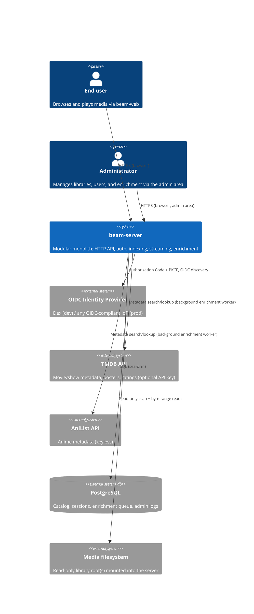

# Architecture Overview

Status: describes the target architecture of this documentation + refactor push. Where the current
codebase differs, this is called out explicitly as "changed from today." See
`docs/requirements/product.md` for the product-level framing this architecture serves.

## System context

Beam is a single self-hosted server (`beam-server`) fronted by a web client (`beam-web`). It reads a
read-only media library from the local filesystem, indexes it, enriches it with metadata from
external providers, authenticates users against an external OIDC identity provider, and serves both
a REST API and direct media byte streams. It persists all of its own state — catalog, sessions,
enrichment queue — in a single Postgres database.



Read direction matters: `beam-server` never writes to the media filesystem. It writes only to
Postgres and to its own separate data/cache directory (used for things like the enrichment worker's
transient state — never for transcoded media, since none is ever produced; see
`streaming.md`). This read-only boundary is a deliberate security and operational invariant, not an
implementation accident — see `security.md`.

## Container view

There is exactly one deployable backend container: `beam-server`. It is a modular monolith —
internally decomposed into well-bounded library crates, but built and deployed as one binary and one
process. This is a deliberate scale-appropriate choice, not an abandoned ambition; see
[ADR-0001](decisions/ADR-0001-modular-monolith.md).

```
┌─────────────────────────────────────────────────────────────────────────┐
│ beam-server (binary crate, formerly "beam-stream")                       │
│                                                                           │
│  HTTP layer (Salvo): REST handlers, OpenAPI spec generation, SSE         │
│  routes, session middleware, static OpenAPI docs UI (Scalar)             │
│                                                                           │
│  ┌────────────┐  ┌────────────┐  ┌────────────┐  ┌─────────────────┐    │
│  │ beam-auth  │  │ beam-index │  │ beam-domain│  │ beam-entity /    │    │
│  │ (lib)      │  │ (lib)      │  │ (lib)      │  │ beam-migration   │    │
│  │ OIDC/BFF,  │  │ scan,      │  │ domain     │  │ sea-orm models   │    │
│  │ sessions   │  │ classify,  │  │ types,     │  │ + schema         │    │
│  │            │  │ enrich     │  │ traits     │  │ migrations       │    │
│  └────────────┘  └────────────┘  └────────────┘  └─────────────────┘    │
└─────────────────────────────────────────────────────────────────────────┘
           │                                              │
           ▼                                              ▼
      PostgreSQL                                   Media filesystem (RO)
```

**Changed from today:** today, `beam-index` is *also* built as a standalone binary that runs as a
second OS process, communicating with `beam-stream` over a single gRPC RPC (`ScanLibrary`, via
tonic/prost) while *both* processes hold independent sea-orm connections to the same Postgres
database. That gRPC/tonic/prost layer, the `beam-index` binary target, and its `Containerfile` are
deleted outright. `beam-index` becomes a library-only crate, called in-process via a plain Rust
function/trait call from `beam-server`. There is exactly one writer to Postgres. `beam-auth` is
likewise demoted from "service with its own binary" to library-only — it has no standalone process
or Containerfile in the target state.

## Components

**beam-server** (binary crate, renamed from `beam-stream`)
The single deployable process. Owns the HTTP server (Salvo), wires together the OpenAPI REST API,
session/auth middleware, SSE progress endpoints, and the byte-range media streaming handlers. Holds
the top-level dependency-injection wiring: it constructs concrete Postgres-backed repositories and
hands them to services as `Arc<dyn Trait>`, and is the only crate allowed to know about HTTP request/
response types. Depends on `beam-domain`, `beam-entity`, `beam-auth`, and `beam-index`. Does **not**
depend on `ffmpeg-next` — see [ADR-0004](decisions/ADR-0004-never-transcode.md).

**beam-domain**
Framework-agnostic core: domain types (movie, show, episode, file, media stream, user, session),
repository traits, provider traits (`EnrichmentProvider`, replacing today's dead `MetadataProvider`
scaffold), and pure domain logic. Has zero dependency on Salvo, sea-orm, or any web framework type —
that isolation is what makes the service layer testable without infrastructure. Also has zero
dependency on `ffmpeg-next` in the target state (see below); codecs are represented as plain
strings/enums, not FFI types.

**beam-entity**
sea-orm entity models mapping 1:1 to Postgres tables. Pure data-shape layer; contains no business
logic. Consumed by concrete repository implementations that satisfy `beam-domain`'s repository
traits.

**beam-migration**
sea-orm-migration schema history. All schema changes — including this push's `sessions`,
`metadata_enrichment`, `anilist_id`, and playback-progress additions, and the `stream_cache` drop —
land here as ordered, reversible migrations. See `data-model.md`.

**beam-auth** (library crate; no standalone binary in the target state)
Implements the OIDC Authorization Code + PKCE flow (via the `openidconnect` crate), JIT user
provisioning keyed by `(issuer, subject)`, admin-role resolution via an email allowlist, and the
`SessionStore` trait plus its Postgres-backed implementation (replacing the current Redis/Valkey
session store). See [ADR-0003](decisions/ADR-0003-oidc-bff-auth.md) and
[ADR-0005](decisions/ADR-0005-sessions-in-postgres.md).

**beam-index** (library crate; no standalone binary or gRPC service in the target state)
Owns library scanning, change detection (size/mtime/XXH3 hash), scene-filename parsing
(title/year extraction), and the async metadata enrichment pipeline built on the `cameo` crate
(TMDB + AniList). This is the only crate in the workspace that links `ffmpeg-next`, and only for
reading technical stream metadata (resolution, codec, duration, bitrate, etc.) at index time — never
at stream time. See [ADR-0006](decisions/ADR-0006-cameo-enrichment.md) and
[ADR-0007](decisions/ADR-0007-vendored-ffmpeg-local-dev.md).

**beam-web**
TypeScript/React single-page web client. The reference (and, this push, only) client of the domain
API. Consumes the REST API through a generated `openapi-fetch` client (see `api.md`), authenticates
via the BFF session cookie, and plays media with a client-side player (Vidstack) that talks HTTP
Range requests directly against `beam-server`.

**beam-docs**
Documentation site tooling/build for user- and operator-facing docs (distinct from this
`docs/architecture` tree, which targets engineers working on the codebase itself).

## Deployment scale and non-goals

This is a modular monolith by deliberate design for the deployment scale Beam targets: a single
self-hosted instance per household or small organization, typically on home-lab-class hardware (NAS,
mini-PC, small VM). It is not a stepping stone abandoned partway through a distributed-systems
rewrite — internal modularity (trait boundaries, in-memory fakes, crate separation) is preserved and
reinforced specifically so that a future split back into separate processes remains *possible*
without a rewrite, should scale ever demand it. The README's longer-term note about a fully
distributed, Kubernetes-native architecture remains a legitimate long-term aspiration, but it is
explicitly out of scope for this push and is not being incrementally built toward right now. See
[ADR-0001](decisions/ADR-0001-modular-monolith.md).
