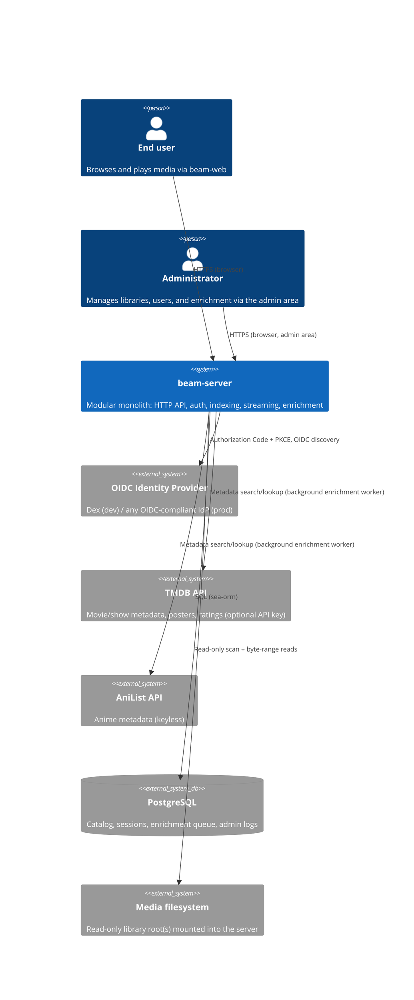

# Architecture Overview

Beam is a single self-hosted server (`beam-server`) fronted by a web client (`beam-web`). It reads a
read-only media library from the local filesystem, indexes it, enriches it with metadata from
external providers, authenticates users against an external OIDC identity provider, and serves both
a REST API and direct media byte streams. It persists all of its own state — catalog, sessions,
enrichment queue — in a single Postgres database. See `docs/requirements/product.md` for the
product-level framing this architecture serves.

The diagrams below describe the deployed Salvo implementation. Kynos is the ratified replacement,
but is not adopted until the [migration readiness gates](kynos-migration-readiness.md) from
[ADR-0010](decisions/ADR-0010-openapi-3-2-kynos.md) pass.

## System context



Read direction matters: `beam-server` never writes to the media filesystem. It writes only to
Postgres and to its own data directory (`BEAM_DATA_DIR`; `/data` in the container image) — never
transcoded media, since none is ever produced (see `streaming.md`). This read-only boundary is a
deliberate security invariant — see `security.md`.

## Container view

There is exactly one deployable backend container: `beam-server`. It is a modular monolith —
internally decomposed into well-bounded library crates, but built and deployed as one binary and one
process, a deliberate scale-appropriate choice
([ADR-0001](decisions/ADR-0001-modular-monolith.md)).

```
┌─────────────────────────────────────────────────────────────────────────┐
│ beam-server (binary crate)                                                │
│                                                                           │
│  HTTP layer (Salvo): REST handlers, OpenAPI spec generation, SSE          │
│  routes, session middleware, static OpenAPI docs UI (Scalar)              │
│                                                                           │
│  ┌────────────┐  ┌────────────┐  ┌────────────┐  ┌─────────────────┐    │
│  │ beam-auth  │  │ beam-index │  │ beam-domain│  │ beam-entity /    │    │
│  │ (lib)      │  │ (lib)      │  │ (lib)      │  │ beam-migration   │    │
│  │ OIDC/BFF,  │  │ scan,      │  │ domain     │  │ sea-orm models   │    │
│  │ sessions   │  │ classify,  │  │ types,     │  │ + schema         │    │
│  │            │  │ enrich     │  │ traits     │  │ migrations       │    │
│  └────────────┘  └────────────┘  └────────────┘  └─────────────────┘    │
└─────────────────────────────────────────────────────────────────────────┘
           │                                              │
           ▼                                              ▼
      PostgreSQL                                   Media filesystem (RO)
```

`beam-client-core` and `beam-android` are deliberately absent from that diagram: neither is linked
into the server binary or its container. They are built and shipped separately, and consume
`beam-server` only across the same public REST API a browser does.

All configuration is environment-driven via `BEAM_*` variables (see
`../operations/configuration.md`). On startup, `beam-server` applies pending database migrations
when `BEAM_AUTO_MIGRATE` is set (the default); operators who prefer manual control disable it and
run the `beam-migration` CLI instead.

## Components

Per-crate detail lives in [components.md](components.md); the one-paragraph map:

**beam-server** (binary crate)
The single deployable process. Owns the HTTP server (Salvo) and wires together the OpenAPI REST API,
session/auth middleware, the admin SSE event stream, the byte-range streaming handlers, and the
in-process indexing and enrichment background workers. Holds the top-level dependency-injection
wiring: it constructs concrete Postgres-backed repositories and hands them to services as
`Arc<dyn Trait>`, and is the only crate allowed to know about HTTP request/response types. Does
**not** link `ffmpeg-next` — see [ADR-0004](decisions/ADR-0004-never-transcode.md).

**beam-domain**
Framework-agnostic core: domain types (movie, show, episode, file, media stream, user, session),
repository and provider traits (`EnrichmentProvider`), and pure domain logic. Zero dependency on
Salvo, sea-orm, or `ffmpeg-next` — that isolation is what makes the service layer testable without
infrastructure. Codecs are plain strings/enums, never FFI types.

**beam-entity**
sea-orm entity models mapping 1:1 to Postgres tables. Pure data-shape layer with no business logic,
consumed by the concrete repository implementations that satisfy `beam-domain`'s traits.

**beam-migration**
sea-orm-migration schema history, applied automatically at startup (gated by `BEAM_AUTO_MIGRATE`)
or manually via its CLI. See `data-model.md`.

**beam-auth** (library crate)
Implements the OIDC Authorization Code + PKCE flow (via the `openidconnect` crate), JIT user
provisioning keyed by `(issuer, subject)`, admin-role resolution from a configured ID-token claim
(`BEAM_OIDC_ADMIN_CLAIM`, issue #85), and the `SessionStore` trait with its Postgres-backed
implementation. See
[ADR-0003](decisions/ADR-0003-oidc-bff-auth.md) and
[ADR-0005](decisions/ADR-0005-sessions-in-postgres.md).

**beam-index** (library crate)
Owns library scanning, change detection (size/mtime/XXH3 hash), scene-filename parsing (title/year
extraction), and the async metadata enrichment pipeline built on the `cameo` crate (TMDB + AniList).
The only crate in the workspace that links `ffmpeg-next`, and only for reading technical stream
metadata at index time — never at stream time. See
[ADR-0006](decisions/ADR-0006-cameo-enrichment.md) and
[ADR-0007](decisions/ADR-0007-vendored-ffmpeg-local-dev.md).

**beam-web**
TypeScript/React single-page web client — the reference client of the domain API. Consumes the REST
API through a generated `openapi-fetch` client (see `api.md`), authenticates via the BFF session
cookie, and plays media with a client-side player (Vidstack) issuing HTTP Range requests directly
against `beam-server`.

**beam-client-core** (library crate)
The logic every native client would otherwise reimplement: the generated REST client, auth state,
TLS trust decisions, codec capability matching, source selection, up-next resolution, the progress
throttle and its retry queue, and cursor paging. Exposed to Kotlin and Swift over UniFFI. Depends
on none of `beam-domain`, `beam-index`, or `beam-server` — see
[ADR-0012](decisions/ADR-0012-native-client-rust-core.md). Not linked into `beam-server`; it is
built for the clients only.

**beam-android**
Kotlin/Compose client for Android phones and tablets, built on `beam-client-core`. Playback is
Media3; only its `core:ffi` module sees the generated bindings or loads the native library.

**beam-docs**
Astro/Starlight site publishing Beam's public landing page and its end-user and operator
documentation, deployed at <https://beam.justinchung.net> (distinct from this `docs/` tree, which
targets engineers working on the codebase itself — see [`components.md`](components.md) for the
division of responsibility).

## Deployment scale and non-goals

Beam targets a single self-hosted instance per household or small organization, typically on
home-lab-class hardware (NAS, mini-PC, small VM). Internal modularity (trait boundaries, in-memory
fakes, crate separation) is preserved so a future split into separate processes remains possible
without a rewrite — see [ADR-0001](decisions/ADR-0001-modular-monolith.md) for the full rationale.

- Distributed / Kubernetes-native deployment: deferred — tracked in
  [#76](https://github.com/justin13888/beam/issues/76).
- Remaining native clients: Android TV [#65](https://github.com/justin13888/beam/issues/65) and
  tvOS/iOS [#66](https://github.com/justin13888/beam/issues/66) are deferred under
  [#78](https://github.com/justin13888/beam/issues/78); both inherit `beam-client-core`. Android
  mobile [#67](https://github.com/justin13888/beam/issues/67) has shipped.
- Adaptive-bitrate streaming (HLS/DASH): deferred — tracked in
  [#75](https://github.com/justin13888/beam/issues/75); see `streaming.md`.
